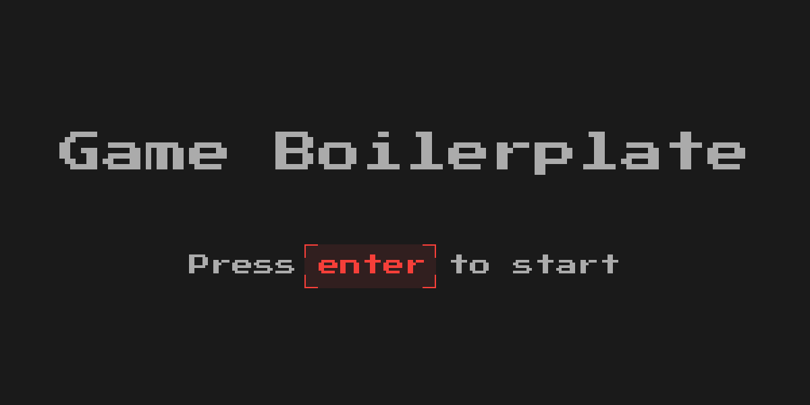
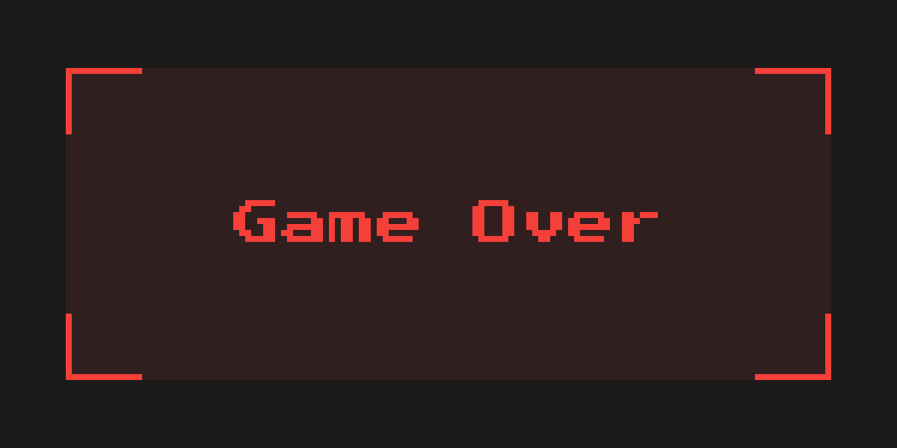

# Game Boilerplate



## Overview

This project is a boilerplate for a game using the MiniLibX library. It includes basic game structures, key handling, and screen layout management.

## Features

- **Key Handling**: Manage key presses and releases to control game states.
- **Screen Layouts**: Different screen layouts for home screen, game screen, inventory, map focus, menu, and game over.
- **Image Handling**: Load and display XPM images.
- **Game Loop**: Update game state based on FPS.
- **Drawing Tools**: Provides simple drawing tools such as circles, rectangles, vertical and horizontal lines, and vertices for diagonal lines.

## Project Structure

| Description       | Repository Path         | Files                                      |
|-------------------|-------------------------|--------------------------------------------|
| Main Source Files | root directory          | `main.c`, `utils.c`, `optimization.c`      |
| Initialization    | `init/`                 | `init_project.c`, `init_game_struct.c`, `init_window_struct.c`, `init_map_struct.c`, `init_player_struct.c`, `init_keys_struct.c`, `init_hooks_logics.c`, `init_xpm_images.c` |
| Game Logic        | `game/`                 | `update.c`, `handle_keys.c`, `layout_home_screen.c`, `layout_game_screen.c` |
| Event Hooks       | `hook/`                 | `expose_hook.c`, `key_hook.c`, `mouse_hook.c` |
| Drawing Tools     | `drawing_tools/`        | `draw_vertex.c`, `draw_rectangle.c`, `draw_circle.c`, `draw_line.c` |
| Assets            | `assets/`               | `home_screen.xpm`, `game_over.xpm`, `inventory.xpm`, `map.xpm`, `menu.xpm` |
| MiniLibX          | `minilibx_linux/`       | MiniLibX library files                     |


## Key Bindings
- **W**: Move forward
- **S**: Move backward
- **A**: Look left
- **D**: Look right
- **E**: Interact
- **Space**: See map
- **Tab**: See inventory
- **M**: Open menu
- **Enter**: Start game
- **ESC**: Exit game

## Getting Started

### Prerequisities
- **MiniLibX**: Ensure you have the MiniLibX library installed.
- **Compiler**: This version use `clang` (feel free to change it).
### Building the Project
To build the project, you simply have to run the following command:

```bash
make
```
### Running the Game
After building the project, you can run the game using (the Makefile already have this rule included):
```bash
./game_boilerplate
```
## TODOs
* [ ] Animation tools

## Contributing
Want to help out? 🧠 Fork the repo, make your changes, and send a pull request.

